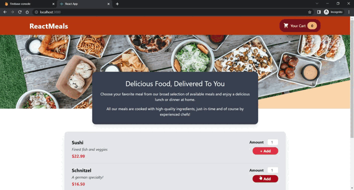

# AK_React_Cart

E-Commerce Cart using :

-  [ useReducer, useState, useEffect, useRef, useContext ]
-  [ React Context (Context API), React Portals, React Fragments, Custom Hooks ]
-  [ Forms and Http Requests ]

preview :




## Getting Started

### 1. Install the dependencies :

```sh
npm i
```

### 2. Start App :

```sh
npm start
```

## By

Ahmed Khairy - github.com/ahkh7
